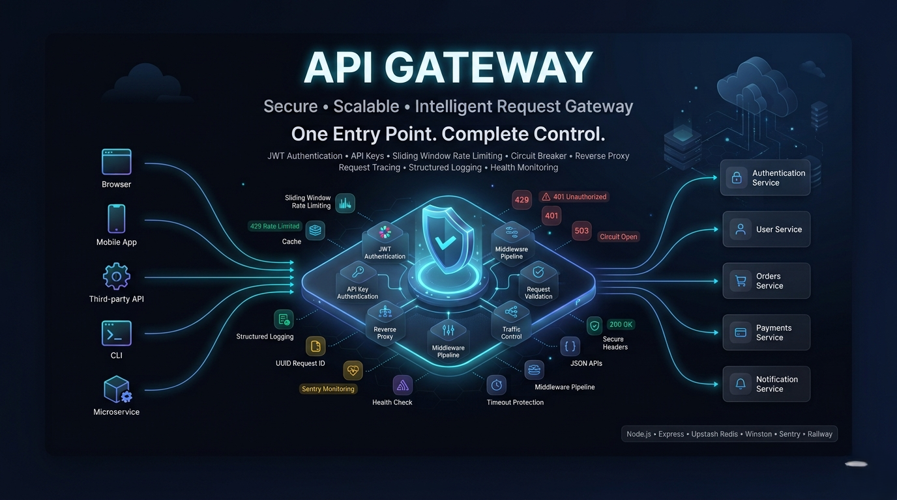
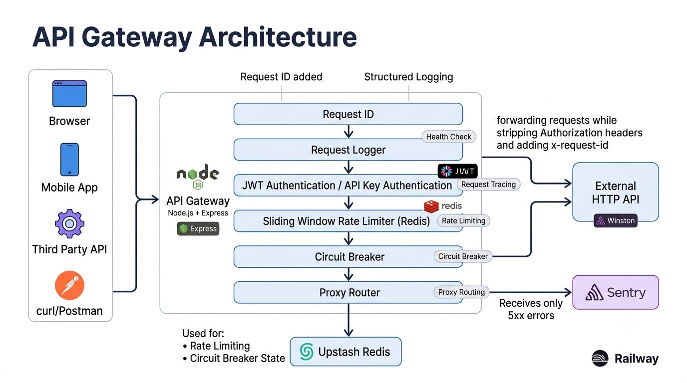
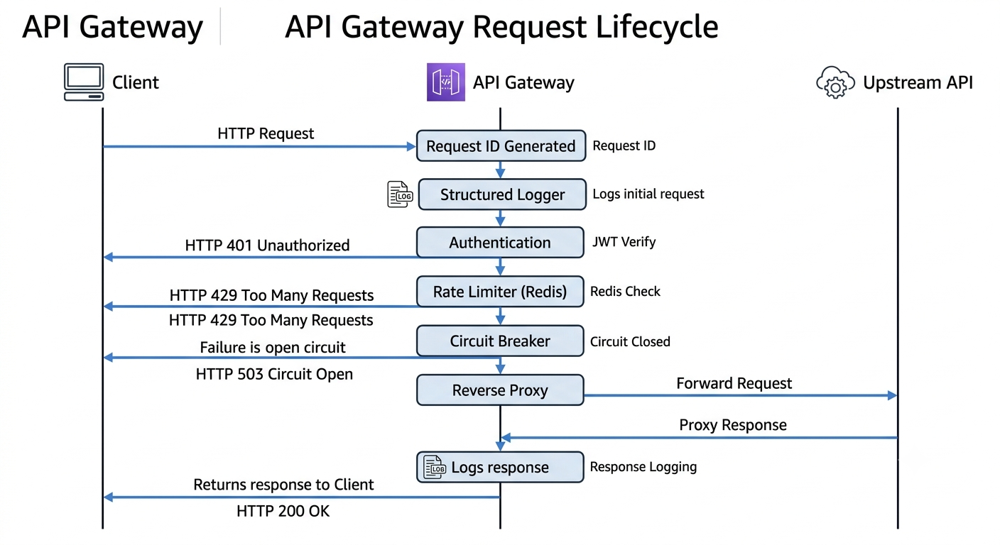
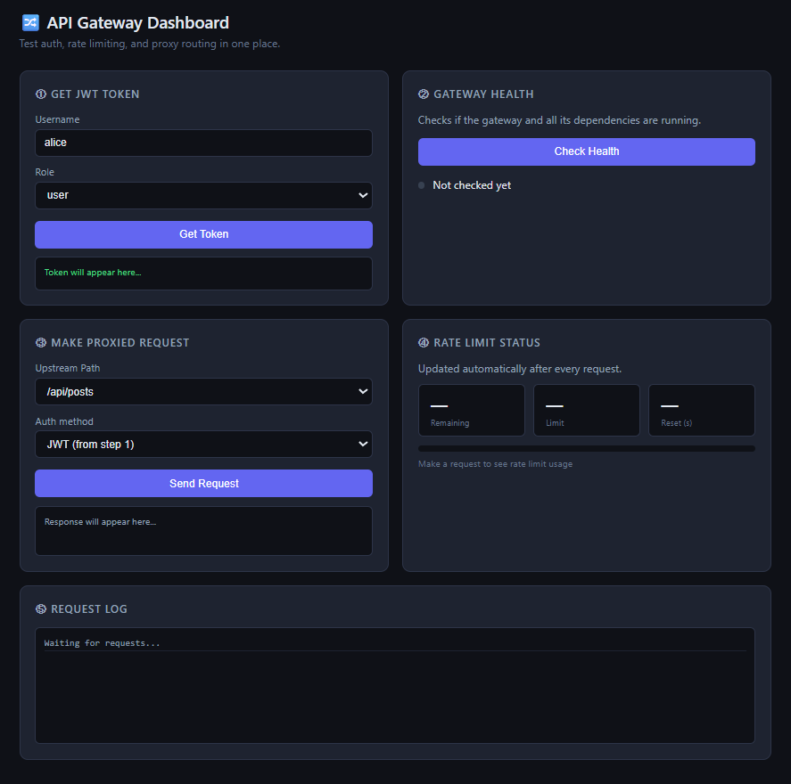
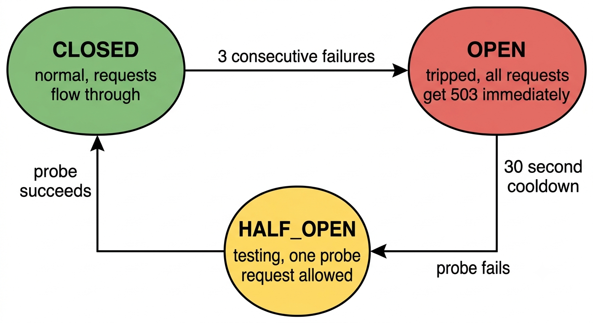

# API Gateway
[](https://nodejs.org)
[](https://expressjs.com)
[](https://upstash.com)
[](./LICENSE)

<p align="center">
  
</p>

> A production-grade API Gateway built with Node.js. Handles authentication, rate limiting, circuit breaking, and request proxying in one enforced middleware pipeline.

---
## 🏗️ Architecture
<p align="center">
  
</p>

---


## 🎯 The Problem

Every backend service needs to answer the same three questions for every request:
- Who is this caller?
- Are they abusing the API?
- What happens when the service they are calling goes down?

Without a gateway, every service solves these independently with duplicated code and different failure behaviors. One team adds rate limiting, another forgets. One service handles upstream failures gracefully, another hangs and returns 500.

This gateway solves all three in one place. Every request passes through one enforcement point before reaching the upstream.

---

## 🔄 Request Lifecycle

### How It Works 
<p align="center">
  
</p>

---

## ✨ Features

**Authentication — two methods, one middleware**
- JWT tokens via `Authorization: Bearer` header — HS256 signed, 1-hour expiry
- API keys via `x-api-key` header — compared using `crypto.timingSafeEqual` to prevent timing attacks
- Both produce the same `req.user` shape — downstream code never knows which method was used

**Rate Limiting — sliding window, not fixed window**
- Fixed window has a bypass: 100 requests at 12:00:59 plus 100 at 12:01:01 both pass because each window shows only 100
- Sliding window always looks at the last N seconds from right now — no bypass window exists
- Backed by Upstash Redis — works correctly across multiple server instances
- All 4 Redis operations run in one pipeline batch — not 4 separate network calls
- Fails open when Redis is down — rate limiting is protection, not core functionality

**Circuit Breaker — automatic upstream failure protection**
- After 3 consecutive failures the circuit trips to OPEN — requests fail in milliseconds, not after 8-second timeouts
- After 30-second cooldown, one probe request tests recovery (HALF_OPEN state)
- Counts both network errors AND upstream HTTP 5xx responses as failures

**Request Proxy**
- Strips `Authorization` and `x-api-key` headers before forwarding — upstream never sees user credentials
- Adds `x-forwarded-by` and `x-request-id` for upstream traceability
- Hard 8-second timeout on every upstream call via `AbortSignal.timeout()`

**Observability**
- UUID stamped at request entry — in every log line, echoed as `x-request-id` response header
- Winston: colorised readable logs in dev, structured JSON in production
- Sentry gets 5xx errors only — 4xx are client mistakes your code handled correctly
- `/health` does live checks — Redis ping and circuit state — returns 503 when degraded

---

## 🖥️ Demo

<p align="center">
  
</p>


The dashboard at `http://localhost:3000` lets you test every feature visually:
- Issue a JWT and use it on the next request immediately
- Send proxied requests and watch the rate limit meter decrease
- See the circuit breaker state update in real time
- Live request log with status codes and timing

---

## Architecture

### ⚙️ Middleware Pipeline — why the order matters

| Step | Middleware | Why at this position |
|---|---|---|
| 1 | `requestId` | Must be first — everything after it needs the ID |
| 2 | `logger` | Needs the ID already set |
| 3 | Public routes `/health`, `/auth/token` | Must be before auth — these cannot require credentials to reach |
| 4 | `authenticate` | Sets `req.user` — rate limiter depends on this |
| 5 | `rateLimiter` | Needs `req.user.id` to key by user not IP |
| 6 | `proxy router` | Only runs after auth and rate limit both passed |
| 7 | `errorHandler` | Must be last — catches errors from everything above |

Swap any two and something breaks. This is architecture, not convention.

### Layer Rules

```
Route       ->  wires URL to controller. Zero logic.
Controller  ->  reads req, calls one service, sends res. No business logic.
Service     ->  all business logic. Zero Express knowledge.
Middleware  ->  intercepts requests. Delegates to services.
```

### 🔌 Circuit Breaker State Machine

<p align="center">
  
</p>


---

## 🛠️ Tech Stack

| Concern | Tool | Why this choice |
|---|---|---|
| Runtime | Node.js 18+ ESM | `import/export` throughout — no CommonJS |
| Framework | Express.js | Middleware pipeline is the entire design |
| Logging | Winston | JSON in prod for log drains, readable in dev |
| Rate limit store | Upstash Redis | Serverless, free tier, shared across instances |
| Config validation | Zod | Validated at boot — server refuses to start on bad config |
| Error tracking | Sentry | 5xx only, free tier |
| Deployment | Railway | Auto-deploys from GitHub, health check rollback |
| Demo upstream | JSONPlaceholder | Public HTTP API, no setup needed |

---

## 📁 Project Structure

```
api-gateway/
├── src/
│   ├── config/
│   │   └── env.js                    # Zod schema validates all env vars at boot
│   ├── controllers/
│   │   ├── auth.controller.js        # Issues JWT tokens
│   │   ├── health.controller.js      # Live dependency checks
│   │   └── proxy.controller.js       # Strips /api prefix, calls proxy service
│   ├── middleware/
│   │   ├── requestId.js              # UUID stamp on every request
│   │   ├── logger.js                 # Logs after response — captures real status and timing
│   │   ├── auth.js                   # JWT + API key, sets req.user
│   │   ├── rateLimiter.js            # Sliding window check, sets X-RateLimit headers
│   │   └── errorHandler.js           # Catches all errors, returns consistent JSON
│   ├── routes/
│   │   ├── health.js                 # GET /health
│   │   ├── auth.js                   # POST /auth/token
│   │   └── proxy.js                  # ALL /api/*
│   ├── services/
│   │   ├── logger.js                 # Winston instance + Sentry initialisation
│   │   ├── redis.js                  # Upstash client + startup connectivity check
│   │   ├── rateLimiter.service.js    # Sliding window algorithm — pure logic, no Express
│   │   ├── proxy.service.js          # HTTP forwarding, header sanitization, timeout
│   │   └── circuitBreaker.service.js # CLOSED / OPEN / HALF_OPEN state machine
│   ├── utils/
│   │   ├── errors.js                 # Custom error classes with HTTP status codes built in
│   │   └── jwt.js                    # signToken / verifyToken wrappers
│   └── app.js                        # Wires the pipeline in the correct order
├── public/
│   └── index.html                    # Dashboard UI — single file, no framework, no build step
├── docs/
│   └── images/                       # Architecture diagrams
├
├── .env.example                      # All required keys listed, no values
├── .railway.toml                     # Deploy config — health check path, restart policy
└── README.md
```

---

## 🚀 Getting Started

### Requirements
- Node.js 18+
- [Upstash](https://upstash.com) — free Redis database, no credit card
- [Sentry](https://sentry.io) — optional, free error tracking

### Install

```bash
git clone https://github.com/YOUR_USERNAME/api-gateway.git
cd api-gateway
npm install
cp .env.example .env
```

Open `.env` and fill in your values. The server will not start if anything is missing — you get a clear error listing exactly what is wrong.

### Run

```bash
npm run dev     # development — colorised logs, auto-restart on save
npm start       # production — JSON structured logs
```

- Dashboard: `http://localhost:3000`

---


### Public

```
GET  /health        Live system status — Redis + circuit breaker state
POST /auth/token    Issue a JWT token
```

### Protected (JWT or API key required)

```
GET    /api/posts
GET    /api/posts/:id
POST   /api/posts
PUT    /api/posts/:id
PATCH  /api/posts/:id
DELETE /api/posts/:id
GET    /api/users
GET    /api/users/:id
GET    /api/todos/:id
```

### Auth examples

```bash
# Get a token
curl -X POST http://localhost:3000/auth/token \
  -H "Content-Type: application/json" \
  -d '{"username": "alice", "role": "user"}'

# Use JWT
curl http://localhost:3000/api/posts \
  -H "Authorization: Bearer YOUR_TOKEN_HERE"

# Use API key
curl http://localhost:3000/api/posts \
  -H "x-api-key: YOUR_API_KEY_HERE"
```

### Response headers on every proxied request

```
x-request-id: 550e8400-e29b-41d4-a716-446655440000
x-gateway: true
x-upstream-duration: 234
x-ratelimit-limit: 30
x-ratelimit-remaining: 28
x-ratelimit-reset: 1750000000
```

### Error shape — always consistent

```json
{
  "error": {
    "message": "No credentials provided",
    "requestId": "550e8400-e29b-41d4-a716-446655440000"
  }
}
```

| Status | When |
|---|---|
| 400 | Missing required field |
| 401 | No credentials, invalid or expired token, wrong API key |
| 429 | Rate limit exceeded — check `x-ratelimit-reset` for retry time |
| 503 | Circuit breaker open — upstream currently down |
| 500 | Unexpected server error |

---

## ⚠️ Known Limitations

| Limitation | Impact | Fix when scaling |
|---|---|---|
| Circuit breaker state is in-memory | Two instances have independent state — one can be OPEN while another sends traffic to a broken upstream | Store in Redis with a Lua script for atomic state transitions |
| Single global API key | Cannot revoke one client without changing it for everyone | Hashed keys in Postgres with per-key metadata and revocation |
| No request body size limit | Clients can send unlimited payload size | `express.json({ limit: '1mb' })` — one line |
| Rate limit race condition | Two simultaneous requests at the exact same millisecond can both pass | Redis Lua script makes check-and-increment atomic |
| No per-route rate limits | Upload routes share the same budget as read routes | Route config map with per-path limit settings |

---

## 🚧 What Comes Next

- Redis-backed circuit breaker — shared state across all instances
- Per-route rate limits and timeout configuration
- Prometheus metrics endpoint — request counts, latency percentiles, circuit trip frequency
- Refresh token flow — short access token plus HTTP-only cookie refresh token with rotation
- Multi-upstream routing — different upstream per path prefix


## 📄 License
MIT License — see [LICENSE](LICENSE) for details.


## 👨‍💻 Author

Built as a backend engineering portfolio project showcasing modern API gateway architecture, secure authentication, request routing, rate limiting, centralized middleware, service orchestration, and production-ready distributed system design.

If you found this project useful, consider giving it a ⭐.